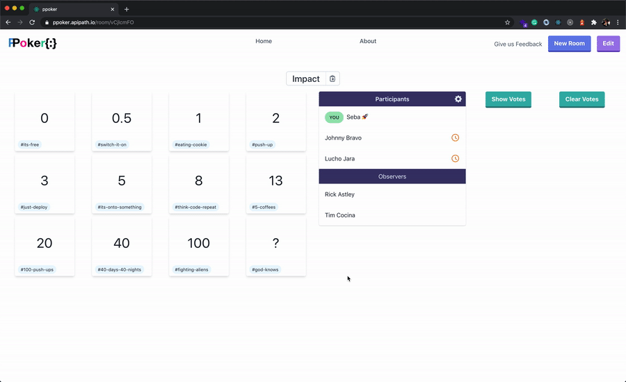

En mi último trabajo utilizabamos una aplicación para estimar tareas durante
[reuniones de
refinamiento](https://www.scrum.org/resources/blog/que-es-el-refinamiento-del-backlog)
pero siempre teniamos problemas con la plataforma, por lo que decidí en mi
tiempo libre construir una aplicación simple, hecha a medida para nuestra
necesidades y a la vez, utilizar [subscripciones](https://www.apollographql.com/docs/react/data/subscriptions/) de
GraphQL y [gqlgen](https://github.com/99designs/gqlgen).

## [ppoker]


La intención de este post es compatir cómo utilicé gqlgen, apollo y
subscripciones GraphQL para construir esta app y lo que se ve en el gif.

> Por cierto, [ppoker] es de uso gratuito, sientanse libres de usar la
> aplicación y de compartir su feedback 🙂

## Backend

Como mencioné previamente en el lado del servidor usamos [go] y [gqlgen], este
es la estructura básica de la aplicación:


```bash
.
├── Makefile
├── go.mod
├── go.sum
├── gqlgen.yml
├── cmd
│  └── server
│      └── server.go
├── pkg
│   ├── graph
│   │   ├── exec.go
│   │   ├── model.go
│   │   ├── mutation.go
│   │   ├── query.go
│   │   ├── resolver.go
│   │   ├── schema.graphql
│   │   ├── server.go
│   │   └── subscription.go
│   └── postgres
│       ├── db.go
│       ├── point.go
│       └── room.go
└── ppoker
    └── ppoker.go
```

Para mantenerlo simple vamos solo a mirar algunos archivos en detalles, como por
ej:

### Makefile

```make
graphql_files = pkg/graph/exec.go pkg/graph/model.go

BIN := ppoker-server
OUTBIN = bin/$(BIN)

default: run

$(graphql_files): gqlgen.yml
	go run github.com/99designs/gqlgen --verbose

graphql:
	go run github.com/99designs/gqlgen --verbose

build: graphql
	go build -o $(OUTBIN) github.com/apipath/ppoker/cmd/server

run: $(graphql_files)
	go run cmd/server/server.go

clean:
	-rm -f $(graphql_files)
	-rm -f $(OUTBIN)

.PHONY: run build clean graphql
```

### schema.graphql

```graphql
type Subscription {
  joinRoom(roomId: ID!, userId: ID!, userName: String!, role: Role!): OnlineRoom
}

type OnlineRoom {
  showVotes: Boolean!
  participants: [Participant!]!
  observers: [Observer!]!
}

```

### ppoker/ppoker.go

This file represents every entity and service in the entire app

```go
package ppoker

import (
	"context"

	"github.com/99designs/gqlgen/graphql"
	"github.com/vektah/gqlparser/v2/gqlerror"
)

// Room struct holds the information for a voting room, it doesn't contain
// information about participating users in the room or any realtime
// related data.
type Room struct {
	ID          string   `json:"id"`
	Name        string   `json:"name"`
	Description *string  `json:"description"`
	Points      []*Point `json:"points"`
}

// Point represents an option a user can vote for in a room
type Point struct {
	Label       string  `json:"label"`
	Description *string `json:"description"`
}

// Participant represents a user who joined a room and can vote.
type Participant struct {
	ID         string `json:"id"`
	Name       string `json:"name"`
	VotedPoint *Point `json:"votedPoint"`
}

// Observer represents a user who joined a room as an observer, meaning
// no voting features enabled.
type Observer struct {
	ID   string `json:"id"`
	Name string `json:"name"`
}

// RoomService provides a high-level API to query and mutate rooms.
type RoomService interface {
	Room(id string) (*Room, error)
	Rooms(ids []string) ([]*Room, error)
	Create(name string, points []*Point) (*Room, error)
	Edit(room *Room, points []*Point) (*Room, error)
}

type ServiceError struct {
	Code        uint
	Description string
	Err         error
}

func (e ServiceError) Error() string {
	return e.Description
}

func (e ServiceError) Unwrap() error {
	return e.Err
}

func NewNotFoundErr(ctx context.Context, err error) *gqlerror.Error {
  return &gqlerror.Error{Message: err.Error(), Path: graphql.GetPath(ctx), Extensions: map[string]interface{}{
    "code": 404,
    "description": "Resource not found",
  }}
}
```

[ppoker]: https://ppoker.apipath.io
[gqlgen]: https://github.com/99designs/gqlgen
[go]: https://golang.org/
